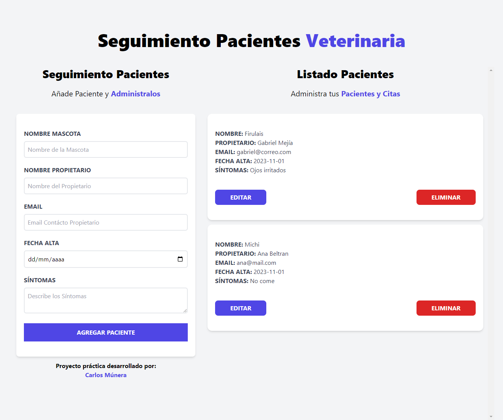

# Sistema de administración de citas veterinarias.

## Descripción del proyecto
* Proyecto de práctica React: Sistema para administar citas veterinarias.
* [Ver Proyecto](https://github.com/CarlosMunera/citas-react)

## Tecnologías Utilizada
* React JS
    * Hook useState
    * Hook UseEffect
    * Local Storage
* Tailwind CSS

## Herramientas - utilidades
* Entorno de desarrollo Vite.

## Autor
* [Alura](https://app.aluracursos.com/user/karlosmunera)
* [LinkedIn](https://www.linkedin.com/in/carlos-munera-259969262 "Linkedin")
* [Portafolio](https://carlosmunera.github.io/portafolio_RETO/)
